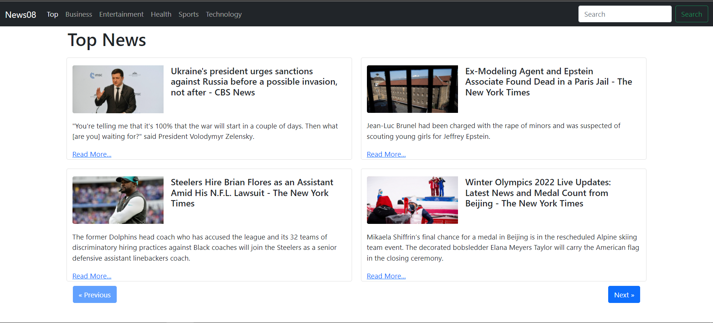

• News08 is a Real‑Time Latest News Application which allows user to read news as per user choice. UI is designed using React.
• Setup routes using react for easyness in fetch choice specific news.
• Backend is implemented using NewsAPI which allows to acess read‑time news.

